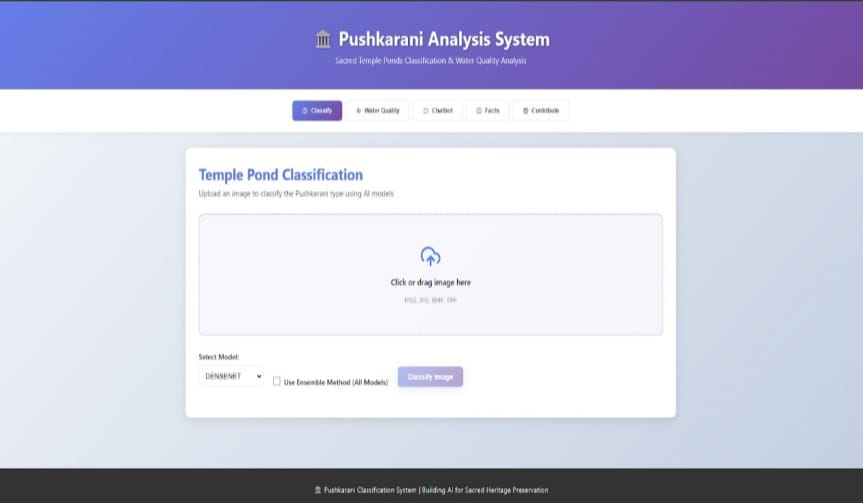
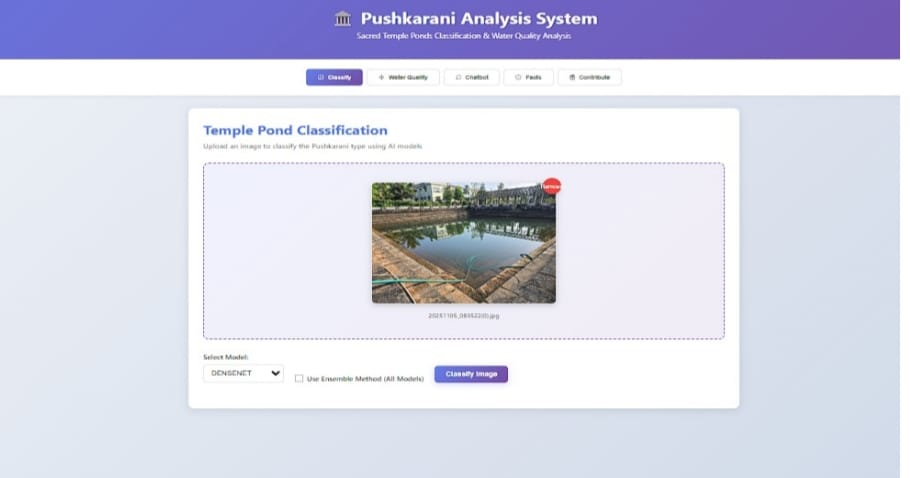
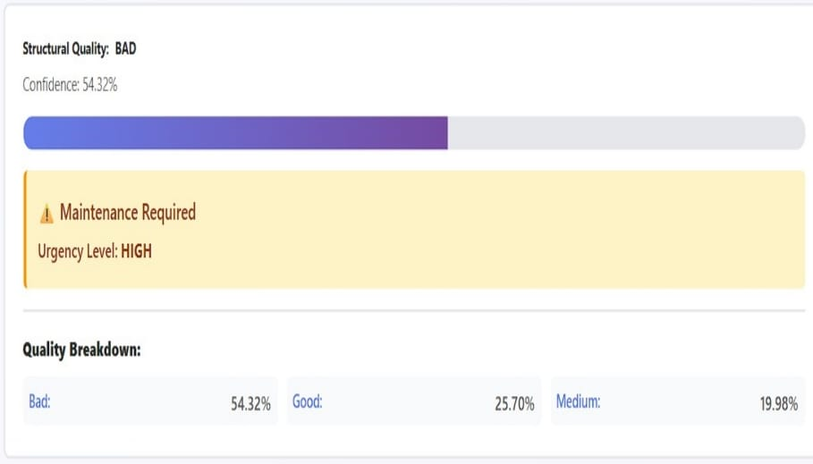
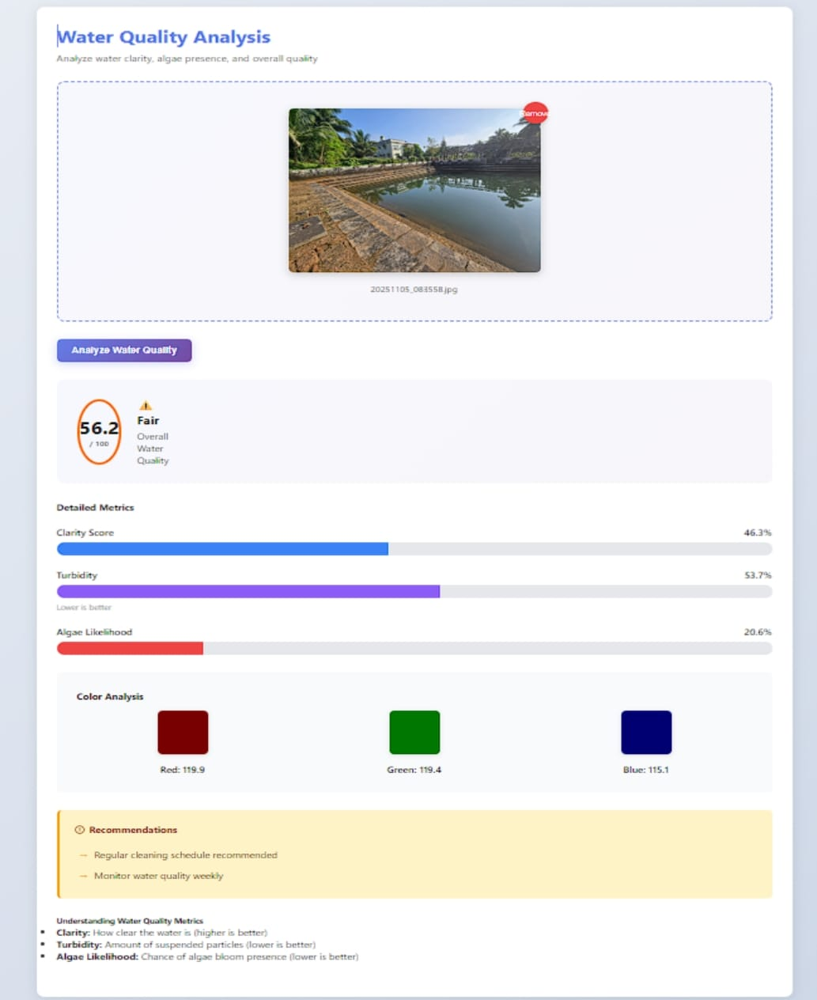
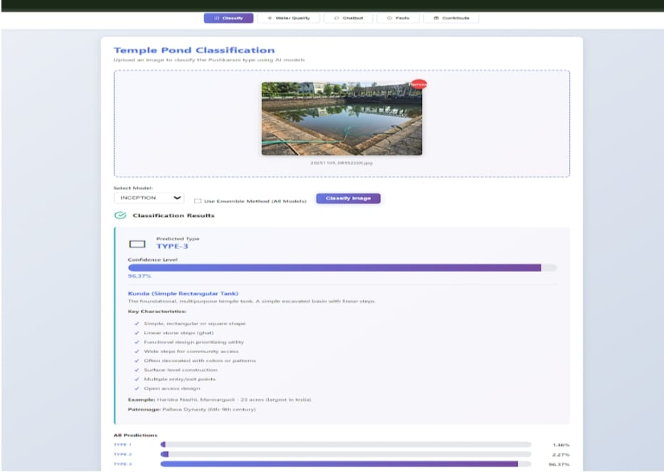
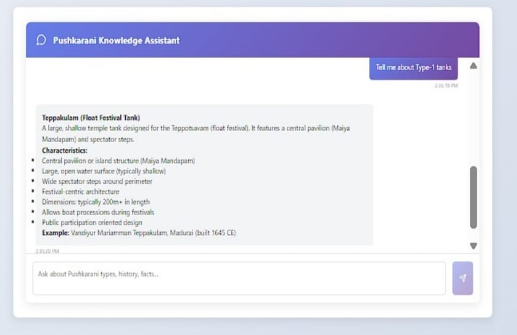
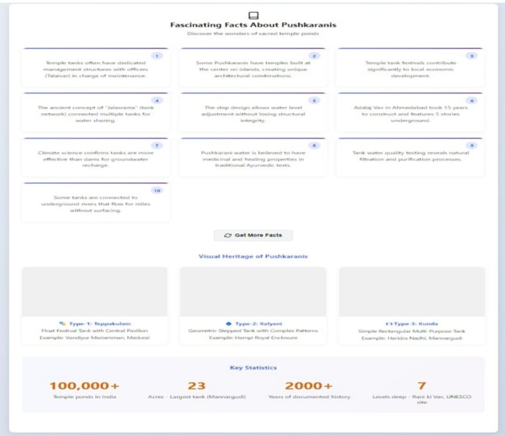
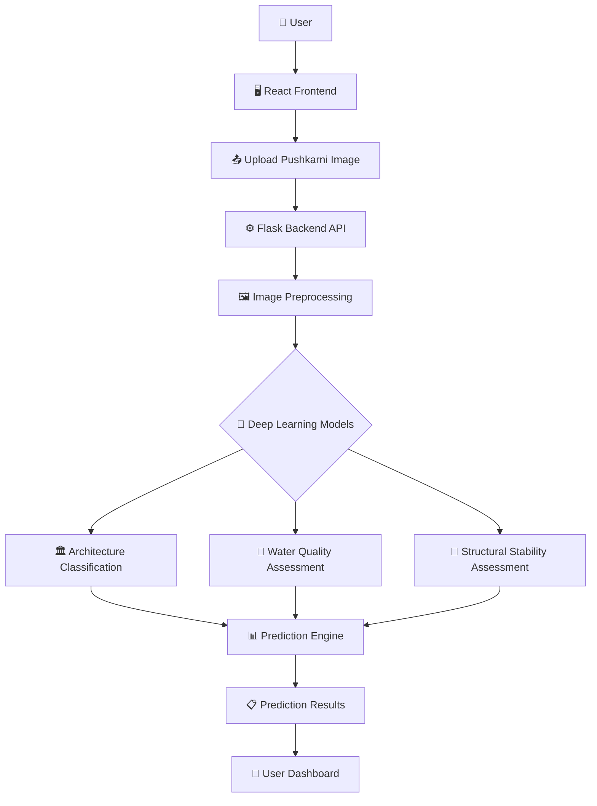
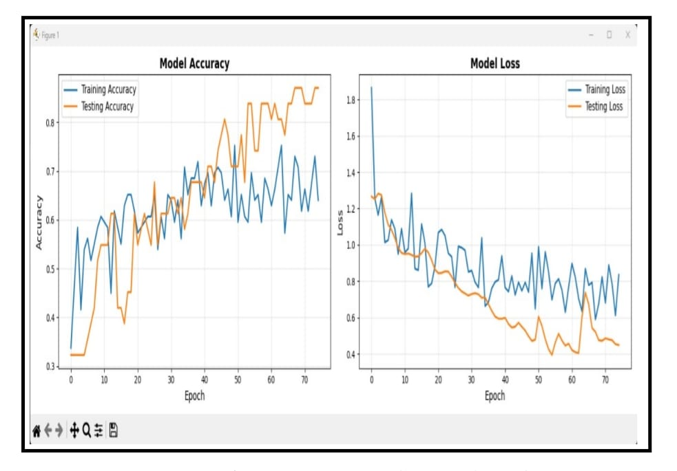
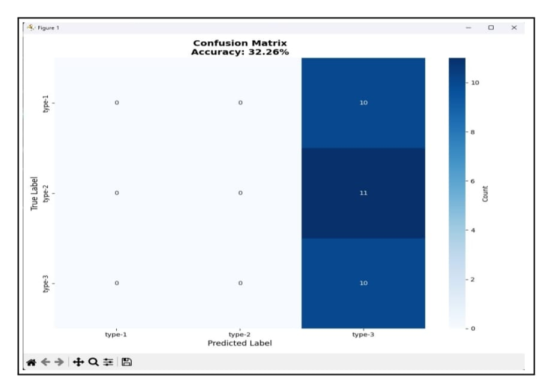

<div align="center">

# 🏛️ Computer Vision System for Heritage Preservation

### AI-Powered Preservation and Conservation of Pushkarnis in Dakshina Kannada using Computer Vision & Deep Learning


---

### 🏛️ Preserving Cultural Heritage Through Artificial Intelligence

*A deep learning framework for automated architectural classification, water quality assessment, and structural stability analysis of Pushkarnis (Temple Tanks) using state-of-the-art Computer Vision models.*

</div>

---

## 🌟 Highlights

- 🏛️ **Architectural Classification** of Pushkarnis
- 🌊 **Water Quality Assessment**
- 🧱 **Structural Stability Analysis**
- 🤖 **9 Deep Learning Models Evaluated**
- 📊 **Custom Heritage Dataset (2644 Images)**
- 🖥️ **Interactive Full-Stack Web Application**
- 📚 **Research-Based Project**
- 🐳 **Docker Ready**

---

# 📖 Overview

Pushkarnis (Temple Tanks) are historically significant water reservoirs found in temple complexes across Southern India. Beyond their religious importance, they serve as valuable examples of traditional hydraulic engineering, architectural craftsmanship, and sustainable water management. However, many Pushkarnis are deteriorating due to pollution, structural degradation, urbanization, and the absence of systematic monitoring.

Traditional heritage documentation relies heavily on manual inspections conducted by experts. While effective, these methods are time-consuming, labor-intensive, subjective, and difficult to scale for large numbers of heritage structures.

This project introduces an **AI-powered Computer Vision framework** that automates the assessment of Pushkarnis using Deep Learning. Given an input image, the system performs multiple analyses simultaneously to support heritage conservation and digital documentation.

The system is capable of:

- 🏛️ Classifying Pushkarnis into different architectural categories
- 🌊 Assessing water quality from visual characteristics
- 🧱 Evaluating structural stability through image analysis
- 🤖 Comparing predictions from multiple state-of-the-art Deep Learning architectures
- 📊 Providing an integrated web interface for researchers, conservation authorities, and heritage enthusiasts

Unlike conventional image classification projects that focus on a single prediction task, this project combines **architectural analysis**, **environmental assessment**, and **structural evaluation** into a unified Computer Vision platform designed specifically for heritage preservation.

The project demonstrates how Artificial Intelligence can assist cultural heritage conservation by providing faster, scalable, and data-driven analysis while reducing dependence on manual inspections.

---

## 🎯 Problem Statement

The Pushkarnis of the Dakshina Kannada region are experiencing gradual deterioration caused by:

- Environmental pollution
- Structural aging and stone erosion
- Water contamination
- Lack of systematic documentation
- Limited availability of heritage experts for large-scale monitoring

Manual inspection methods are often slow, subjective, and difficult to perform regularly across numerous heritage sites.

This project addresses these challenges by leveraging **Computer Vision** and **Deep Learning** to automate the classification and assessment of Pushkarnis from images, enabling faster documentation and supporting long-term conservation efforts.

---

## 💡 Why This Project?

This project sits at the intersection of:

- 🏛️ Heritage Conservation
- 🤖 Artificial Intelligence
- 👁️ Computer Vision
- 🧠 Deep Learning
- 🌍 Environmental Monitoring

Rather than replacing heritage experts, the system is intended to function as an intelligent decision-support tool that assists researchers and conservation authorities by providing consistent and automated visual analysis.

Its modular design also allows future integration with drones, GIS systems, mobile applications, and large-scale digital heritage initiatives.

# ✨ Key Features

## 🏛 Heritage Analysis

### 🏗 Architectural Classification

Automatically classifies Pushkarnis into three distinct architectural styles using deep learning.

- **Type 1 — Teppakulam**
- **Type 2 — Kalyani**
- **Type 3 — Kunda**

This enables rapid digital documentation of heritage structures while reducing reliance on manual classification.

---

### 🌊 Water Quality Assessment

Evaluates the visual condition of water present in Pushkarnis using computer vision.

Prediction Categories:

- ✅ Good
- ⚠ Fair
- ❌ Bad

The assessment assists conservation authorities in identifying deteriorating water conditions that may require maintenance.

---

### 🧱 Structural Stability Analysis

Analyzes the structural condition of Pushkarnis from images.

Prediction Categories:

- ✅ Good
- ⚠ Medium
- ❌ Bad

The system assists in identifying visible deterioration that may require conservation or restoration.

---

# 🤖 Artificial Intelligence

### 🧠 Multi-Model Deep Learning Framework

Instead of relying on a single neural network, the project evaluates multiple state-of-the-art Deep Learning architectures for heritage image analysis.

Supported Models include:

- DenseNet
- MobileNet
- MobileNetV2
- ResNet50
- Inception
- EfficientNetV2
- ConvNeXt
- Swin Transformer
- DINOv2

This comparative evaluation provides insights into the suitability of different CNN and Vision Transformer architectures for fine-grained heritage classification.

---

### 📊 Model Performance Comparison

The project compares multiple deep learning models under a consistent experimental setup, enabling objective evaluation across architectural classification tasks.

The comparative study highlights the strengths and limitations of lightweight CNNs, deep CNNs, and Transformer-based architectures.

---

# 💻 Full Stack Application

### 🖥 Interactive Web Interface

The project includes an integrated web application that allows users to:

- Upload Pushkarni images
- Select prediction models
- View prediction results
- Analyze heritage structures interactively

The application provides an accessible interface for researchers, students, and heritage conservation authorities.

---

### ⚙ Modular Backend

The backend exposes prediction functionality through modular APIs responsible for:

- Image preprocessing
- Model inference
- Prediction generation
- Response handling

The modular architecture allows new models to be integrated with minimal code changes.

---

### 🎨 Modern Frontend

The React-based frontend provides:

- Clean user interface
- Image upload functionality
- Prediction visualization
- Interactive heritage analysis

---

# 📂 Custom Heritage Dataset

A dedicated dataset was developed specifically for this project.

The dataset includes:

- Architectural images
- Water quality images
- Structural stability images

Dataset Characteristics:

- 2644 Images
- 9 Prediction Labels
- DSLR Images
- Mobile Camera Images
- Drone Images
- Multiple Lighting Conditions
- Diverse Camera Angles
- Real Environmental Variations

---

# 🚀 Engineering Highlights

- End-to-End Deep Learning Pipeline
- Automated Image Preprocessing
- Modular Project Structure
- Docker Support
- Full-Stack Architecture
- Research-Oriented Design
- Heritage Conservation Focus
- Scalable Prediction Framework

---

# 📸 Demo & Screenshots

> **Note**
>
> Replace the placeholder images below with actual screenshots from the running application.
> Store all images inside the `assets/` directory.

---

## 🏠 Home Page

The landing page provides an overview of the system and allows users to upload Pushkarni images for analysis.

<p align="center">
  
</p>

---

## 📤 Image Upload

Users can upload an image of a Pushkarni and select a deep learning model for analysis.

<p align="center">
  
</p>

---

## 🤖 Prediction Results

The system performs AI-based analysis and displays:

- Architectural Type
- Water Quality
- Structural Stability

<p align="center">
  
</p>

---

## 🌊 Water Quality Analysis

Visual assessment of water quality using the trained deep learning model.

<p align="center">
  
</p>

---

## 🧱 Structural Stability Analysis

Structural condition prediction generated by the AI model.

<p align="center">
  
</p>

---

## 💬 Heritage Chatbot

The integrated chatbot provides information related to Pushkarnis and assists users in understanding prediction results.

<p align="center">
  
</p>

---

## 📚 Heritage Information

The application also presents educational information and interesting facts about Pushkarnis to promote awareness of their cultural significance.

<p align="center">
  
</p>

---


# 🏗️ System Architecture

The system follows a modular full-stack architecture that integrates a React frontend, Flask backend, image preprocessing pipeline, multiple Deep Learning models, and prediction services into a unified heritage analysis platform.



---

# ⚙️ System Components

## 🖥️ Frontend

The frontend provides an interactive interface that enables users to upload Pushkarni images, choose prediction models, and visualize analysis results.

### Responsibilities

- Image Upload
- User Interaction
- Model Selection
- Result Visualization
- Heritage Information Display

---

## 🔗 Backend

The backend acts as the central processing layer responsible for handling requests from the frontend and coordinating the prediction pipeline.

### Responsibilities

- REST API
- Request Validation
- Image Processing
- Model Loading
- Prediction Generation
- Response Formatting

---

## 🖼️ Image Processing Pipeline

Before inference, every uploaded image passes through a preprocessing stage to ensure compatibility with trained models.

The preprocessing pipeline includes:

- Image Loading
- Image Resizing
- Normalization
- Tensor Conversion
- Batch Preparation

---

## 🤖 Deep Learning Layer

The project evaluates multiple state-of-the-art Deep Learning architectures under a common experimental setup.

Supported architectures include:

- DenseNet
- MobileNet
- MobileNetV2
- ResNet50
- Inception
- EfficientNetV2
- ConvNeXt
- Swin Transformer
- DINOv2

Each model processes the input image independently and produces predictions for heritage analysis tasks.

---

## 📊 Prediction Engine

The prediction engine interprets model outputs and generates user-friendly results.

The engine provides:

- Architectural Category
- Water Quality Status
- Structural Stability Status

These predictions are then returned to the frontend for visualization.

---

# 🔄 End-to-End Workflow

```text
User
 │
 ▼
Upload Image
 │
 ▼
Frontend
 │
 ▼
Backend API
 │
 ▼
Image Preprocessing
 │
 ▼
Deep Learning Model
 │
 ├────────► Architecture Prediction
 │
 ├────────► Water Quality Prediction
 │
 └────────► Structural Stability Prediction
 │
 ▼
Prediction Engine
 │
 ▼
Frontend Dashboard
 │
 ▼
User
```

---

# 🧩 Design Principles

The project is designed using a modular architecture to simplify maintenance, testing, and future expansion.

### ✔ Separation of Concerns

Each module performs a single responsibility.

### ✔ Reusable Components

Frontend and backend modules are designed to support future models with minimal modification.

### ✔ Scalable Pipeline

Additional prediction models can be integrated without changing the overall system architecture.

### ✔ Maintainability

Independent modules simplify debugging, testing, and deployment.

---

# 📦 Deployment Architecture

```text
                Browser
                    │
                    ▼
             React Frontend
                    │
             HTTP Requests
                    │
                    ▼
              Flask Backend
                    │
        ┌───────────┼───────────┐
        ▼           ▼           ▼
 Architecture   Water Quality   Structural
 Classification  Assessment     Stability
        │           │             │
        └───────────┼─────────────┘
                    ▼
            Prediction Response
                    │
                    ▼
               React Frontend
```

---

# 📂 Repository Structure

The project follows a modular architecture that separates the frontend, backend, deep learning models, datasets, and supporting resources into independent components. This organization improves maintainability, scalability, and ease of development.

```text
Computer-Vision-System-for-Heritage-Preservation/
│
├── backend/                     # Flask backend and REST APIs
│
├── frontend/                    # React web application
│
├── models/                      # Trained Deep Learning models
│   ├── DenseNet/
│   ├── MobileNet/
│   ├── MobileNetV2/
│   ├── ResNet50/
│   ├── Inception/
│   ├── EfficientNetV2/
│   ├── ConvNeXt/
│   ├── Swin/
│   └── DINOv2/
│
├── dataset/                     # Original dataset
│
├── dataset_split/               # Train / Validation / Test splits
│
├── train.py                     # Model training pipeline
├── test_system.py               # System testing
├── verify_setup.py              # Environment verification
│
├── requirements.txt             # Python dependencies
├── docker-compose.yml           # Docker Compose configuration
├── Dockerfile.backend           # Backend container
├── Dockerfile.frontend          # Frontend container
│
└── README.md
```

---

# 📦 Directory Description

## 🖥️ backend/

Contains the server-side implementation responsible for:

- REST API endpoints
- Image preprocessing
- Model loading
- Prediction pipeline
- Response generation

This module acts as the bridge between the frontend and the deep learning models.

---

## 🎨 frontend/

Contains the complete React application.

Responsible for:

- User Interface
- Image Upload
- Prediction Display
- Heritage Information
- User Interaction

---

## 🤖 models/

Stores all trained Deep Learning models used by the system.

Implemented architectures include:

- DenseNet
- MobileNet
- MobileNetV2
- ResNet50
- Inception
- EfficientNetV2
- ConvNeXt
- Swin Transformer
- DINOv2

Each model is independently organized to simplify evaluation and deployment.

---

## 📂 dataset/

Contains the original Pushkarni image dataset collected for this project.

The dataset includes images for:

- Architectural Classification
- Water Quality Assessment
- Structural Stability Analysis

---

## 📊 dataset_split/

Contains the processed dataset divided into:

- Training Set
- Validation Set
- Testing Set

This separation enables consistent model evaluation.

---

## 🧠 train.py

Main training script responsible for:

- Dataset loading
- Image preprocessing
- Model training
- Validation
- Saving trained models

---

## ✅ test_system.py

Performs system-level testing to verify that the prediction pipeline works correctly after deployment.

---

## ⚙️ verify_setup.py

Checks the local environment before execution by verifying dependencies and required project components.

---

## 📄 requirements.txt

Lists all required Python packages necessary to run the project.

Dependencies can be installed using:

```bash
pip install -r requirements.txt
```

---

## 🐳 Docker Configuration

The repository includes Docker support for simplified deployment.

Files:

- Dockerfile.backend
- Dockerfile.frontend
- docker-compose.yml

These files allow the application to run consistently across different environments.

---

# 🏛 Project Organization Philosophy

The repository follows a modular design with clear separation between:

```text
Frontend
     │
     ▼
Backend APIs
     │
     ▼
Image Processing
     │
     ▼
Deep Learning Models
     │
     ▼
Prediction Engine
     │
     ▼
User Interface
```

This organization makes the project:

- ✅ Easy to understand
- ✅ Easy to maintain
- ✅ Easy to extend
- ✅ Easy to deploy

---

# 📈 Scalability

The modular structure allows future enhancements such as:

- Additional Deep Learning models
- New prediction tasks
- Mobile applications
- Cloud deployment
- Drone integration
- GIS support

without requiring major architectural changes.

---

# 📊 Dataset

A dedicated dataset was curated specifically for this research to enable automated analysis of **Pushkarnis (Temple Tanks)** in the Dakshina Kannada region. Since no publicly available benchmark dataset exists for this domain, images were collected, annotated, and validated to support deep learning–based heritage analysis.

The dataset was designed to represent real-world environmental conditions and architectural diversity while maintaining balanced class distributions across multiple prediction tasks.

---

# 📈 Dataset Statistics

| Category | Number of Images | Number of Classes |
|----------|-----------------:|------------------:|
| Architectural Classification | 882 | 3 |
| Water Quality Assessment | 882 | 3 |
| Structural Stability Assessment | 880 | 3 |
| **Total** | **2644** | **9 Labels** |

---

# 🏛 Classification Categories

## Architectural Types

The system classifies Pushkarnis into three architectural categories.

### Type 1 — Teppakulam

Large temple tanks characterized by:

- Wide open water surface
- Large surrounding steps
- Central pavilion (Mandapam)
- Designed for festivals and public gatherings

---

### Type 2 — Kalyani

Traditional stepped temple tanks featuring:

- Symmetrical geometry
- Multi-level descending steps
- Stone construction
- Intricate architectural detailing

---

### Type 3 — Kunda

Simpler temple tanks typically consisting of:

- Rectangular or square layouts
- Linear stone steps
- Multiple access points
- Community-oriented design

---

# 🌊 Water Quality Classes

The system predicts the visual condition of water into three categories.

| Class | Description |
|--------|-------------|
| ✅ Good | Clear water with minimal turbidity |
| ⚠ Fair | Moderate clarity with slight visual degradation |
| ❌ Bad | High turbidity, discoloration, algae, or contamination |

---

# 🧱 Structural Stability Classes

The structural condition of Pushkarnis is categorized into:

| Class | Description |
|--------|-------------|
| ✅ Good | Well-preserved stone structures with minimal deterioration |
| ⚠ Medium | Moderate weathering requiring maintenance |
| ❌ Bad | Severe structural degradation requiring restoration |

---

# 📸 Data Collection

The dataset was collected from Pushkarnis located in the **Dakshina Kannada** region using multiple imaging platforms.

Image sources included:

- 📷 DSLR Cameras
- 📱 Mobile Cameras
- 🚁 Drone Imagery

The collection process intentionally captured natural environmental diversity to improve model robustness.

---

# 🌤 Environmental Diversity

Images were collected under a wide variety of real-world conditions, including:

### Lighting

- Morning
- Afternoon
- Evening

### Weather

- Sunny
- Cloudy
- Overcast

### Camera Angles

- Front View
- Side View
- Diagonal View
- Top View (Drone)

### Water Conditions

- Clear Water
- Algae Growth
- Turbid Water
- Surface Reflections

These variations improve the model's ability to generalize across different field conditions.

---

# 🏷 Annotation Process

Dataset annotation followed a multi-stage validation process.

### Stage 1

Initial manual labeling based on:

- Architectural layout
- Step geometry
- Water appearance
- Structural condition

---

### Stage 2

Independent review of ambiguous samples to improve labeling consistency.

---

### Stage 3

Final validation to ensure accurate category assignment before model training.

---

# 📂 Dataset Split

The dataset was divided using a stratified sampling strategy to preserve class balance.

| Dataset | Images |
|----------|-------:|
| Training | 705 |
| Validation | 177 |
| Testing | 177 |

This ensures reliable and unbiased model evaluation.

---

# 🖼 Image Preprocessing

Before training, every image undergoes a standardized preprocessing pipeline.

The preprocessing includes:

- Image resizing
- Normalization
- Data augmentation
- Tensor conversion

Images are resized to **224 × 224 pixels**, making them compatible with all evaluated deep learning architectures.

---

# ⚠ Dataset Challenges

The dataset presents several real-world challenges that make automated heritage analysis difficult.

## Fine-Grained Architectural Differences

Many Pushkarnis share visually similar layouts, requiring models to learn subtle architectural features.

---

## Environmental Variability

Performance must remain robust under:

- Changing illumination
- Shadows
- Reflections
- Vegetation
- Seasonal variations

---

## Perspective Variations

Images captured from different viewpoints introduce scale and geometric variation.

---

## Limited Domain-Specific Data

Unlike common computer vision datasets, heritage datasets are relatively small, making transfer learning an essential component of the training pipeline.

---

# 🎯 Why This Dataset Matters

Most existing computer vision datasets focus on everyday objects or general scene understanding.

This dataset addresses a unique application domain by supporting AI-driven analysis of **architectural heritage**, **environmental monitoring**, and **structural assessment** within a single integrated framework.

It provides a foundation for future research in:

- Digital Heritage Preservation
- Cultural Informatics
- Structural Health Monitoring
- Computer Vision for Archaeology
- AI-assisted Conservation

---

# 🧠 Deep Learning Models

A major objective of this project was to evaluate the effectiveness of different Deep Learning architectures for heritage image analysis.

Rather than relying on a single model, multiple Convolutional Neural Networks (CNNs) and Vision Transformer (ViT) architectures were trained and compared under a consistent experimental setup.

The study investigates how different network architectures perform when classifying Pushkarnis, assessing water quality, and evaluating structural stability.

---

# 🔬 Models Evaluated

## 📱 MobileNet

MobileNet is a lightweight convolutional neural network optimized for mobile and edge devices.

### Characteristics

- Lightweight architecture
- Low computational cost
- Fast inference
- Efficient depthwise separable convolutions

### Why MobileNet?

Its computational efficiency makes it suitable for real-time heritage monitoring systems and future mobile deployments.

---

## 📱 MobileNetV2

MobileNetV2 improves upon the original MobileNet by introducing inverted residual blocks and linear bottlenecks.

### Advantages

- Better feature representation
- Lower memory consumption
- Improved accuracy
- Faster convergence

This model provides an excellent balance between accuracy and computational efficiency.

---

## 🧠 ResNet50

ResNet50 is a deep residual convolutional neural network that addresses the degradation problem in deep architectures through residual learning.

### Key Features

- Residual Skip Connections
- Deep Feature Extraction
- Improved Gradient Flow
- Strong Image Recognition Performance

ResNet50 serves as a strong baseline for comparison against newer architectures.

---

## 🌐 Inception

The Inception architecture extracts image features at multiple spatial scales simultaneously.

### Advantages

- Multi-scale feature extraction
- Efficient computation
- Improved representation of complex image structures

Its architecture makes it well suited for recognizing intricate architectural patterns present in Pushkarnis.

---

## 🌿 DenseNet

DenseNet introduces dense connectivity between layers, allowing feature reuse throughout the network.

### Advantages

- Improved feature propagation
- Reduced vanishing gradient problem
- Better parameter efficiency
- Strong performance on relatively small datasets

DenseNet demonstrated excellent capability for learning fine-grained architectural details.

---

## ⚡ EfficientNetV2

EfficientNetV2 scales network depth, width, and resolution in a balanced manner while maintaining computational efficiency.

### Characteristics

- Optimized training speed
- High parameter efficiency
- Improved accuracy
- Better scalability

It provides a strong balance between computational cost and predictive performance.

---

## 🔷 ConvNeXt

ConvNeXt modernizes traditional convolutional neural networks by incorporating design principles inspired by Vision Transformers.

### Advantages

- Modern CNN architecture
- Improved feature extraction
- Better scalability
- Competitive performance with Transformer models

ConvNeXt demonstrates how modern CNN designs continue to remain highly competitive.

---

## 🔺 Swin Transformer

Swin Transformer introduces hierarchical Vision Transformers using shifted windows for efficient visual representation learning.

### Key Features

- Hierarchical architecture
- Shifted window attention
- Local and global feature learning
- Improved scalability

This architecture enables transformer-based analysis of complex heritage imagery.

---

## 🛰 DINOv2

DINOv2 is a self-supervised Vision Transformer designed for robust visual feature extraction.

### Advantages

- Self-supervised learning
- Strong feature representation
- Excellent transfer learning capability
- General-purpose visual understanding

Its ability to learn generalized visual representations makes it valuable for heritage image analysis.

---

# ⚙ Experimental Pipeline

Every model follows the same training workflow to ensure fair comparison.

```text
Dataset
   │
   ▼
Image Preprocessing
   │
   ▼
Training
   │
   ▼
Validation
   │
   ▼
Testing
   │
   ▼
Performance Evaluation
```

---

# 🖼 Image Preprocessing Pipeline

Before training, all images undergo identical preprocessing.

### Standardization

- Image Resizing
- Normalization
- Tensor Conversion

### Input Resolution

```
224 × 224 pixels
```

Using a common preprocessing pipeline ensures consistent evaluation across all architectures.

---

# 🎯 Prediction Tasks

Every model is evaluated on three independent heritage analysis tasks.

| Task | Output |
|------|--------|
| 🏛 Architectural Classification | Teppakulam / Kalyani / Kunda |
| 🌊 Water Quality Assessment | Good / Fair / Bad |
| 🧱 Structural Stability Assessment | Good / Medium / Bad |

---

# 📊 Comparative Evaluation

The objective of this work is not merely to train a single high-performing model, but to understand how different neural network architectures behave on fine-grained heritage image analysis.

The comparative study provides insights into:

- Performance of lightweight CNNs
- Performance of deep CNNs
- Performance of Vision Transformers
- Trade-offs between computational efficiency and predictive capability
- Suitability of each architecture for heritage preservation applications

---

# 💡 Why Multiple Models?

Different deep learning architectures capture visual information differently.

Evaluating multiple architectures provides:

- Better understanding of model behavior
- Fair architectural comparison
- Improved reproducibility
- Stronger research contribution
- Guidance for future heritage conservation systems

This comparative approach forms one of the core contributions of the project by identifying suitable deep learning architectures for AI-assisted heritage preservation.

---

# 📈 Results & Model Performance

The proposed Computer Vision framework was evaluated using multiple state-of-the-art Deep Learning architectures to analyze Pushkarnis across three independent heritage assessment tasks.

The experimental evaluation focused on:

- 🏛 Architectural Classification
- 🌊 Water Quality Assessment
- 🧱 Structural Stability Assessment

The objective was to compare different CNN and Vision Transformer architectures under a consistent experimental setup and identify suitable models for AI-assisted heritage preservation.

---

# 🏆 Model Comparison

> **Note**
>
> Replace the accuracy values below with the final results reported in the project report.

| Model | Architecture Classification | Water Quality | Structural Stability |
|--------|----------------------------:|--------------:|---------------------:|
| DenseNet | XX.XX% | XX.XX% | XX.XX% |
| MobileNet | XX.XX% | XX.XX% | XX.XX% |
| MobileNetV2 | XX.XX% | XX.XX% | XX.XX% |
| ResNet50 | XX.XX% | XX.XX% | XX.XX% |
| Inception | XX.XX% | XX.XX% | XX.XX% |
| EfficientNetV2 | XX.XX% | XX.XX% | XX.XX% |
| ConvNeXt | XX.XX% | XX.XX% | XX.XX% |
| Swin Transformer | XX.XX% | XX.XX% | XX.XX% |
| DINOv2 | XX.XX% | XX.XX% | XX.XX% |

---

# 📊 Evaluation Metrics

The models were evaluated using standard classification metrics.

- Accuracy
- Precision
- Recall
- F1-Score

These metrics provide a balanced assessment of classification performance across the different prediction tasks.

---

# 🎯 Prediction Tasks

The trained models generate three independent predictions for every uploaded Pushkarni image.

| Prediction Task | Output Classes |
|----------------|----------------|
| 🏛 Architectural Classification | Teppakulam • Kalyani • Kunda |
| 🌊 Water Quality Assessment | Good • Fair • Bad |
| 🧱 Structural Stability Assessment | Good • Medium • Bad |

---

# 📸 Sample Predictions

The following examples illustrate predictions generated by the deployed system.

## Example 1

| Input Image | Prediction |
|-------------|------------|
| *(Insert Screenshot)* | Architecture: Kalyani<br>Water Quality: Good<br>Structural Stability: Good |

---

## Example 2

| Input Image | Prediction |
|-------------|------------|
| *(Insert Screenshot)* | Architecture: Teppakulam<br>Water Quality: Fair<br>Structural Stability: Medium |

---

## Example 3

| Input Image | Prediction |
|-------------|------------|
| *(Insert Screenshot)* | Architecture: Kunda<br>Water Quality: Bad<br>Structural Stability: Bad |

---

# 📉 Training Curves

The learning behaviour of the models can be visualized using the following graphs.

> Replace the placeholders with training plots generated during model training.

<p align="center">




</p>

---

# 📊 Confusion Matrix

The confusion matrix provides detailed insight into prediction performance for each class.

<p align="center">



</p>

---

# 🔍 Qualitative Analysis

The trained models successfully learned visual characteristics associated with:

- Architectural geometry
- Stone step patterns
- Water appearance
- Surface texture
- Structural degradation

The comparative evaluation demonstrates that modern Deep Learning architectures are capable of extracting discriminative visual features from heritage structures and can assist conservation professionals in large-scale documentation and monitoring.

---

# 💡 Key Observations

The experimental study demonstrates that:

- Different network architectures exhibit varying strengths across prediction tasks.
- Modern CNNs and Vision Transformers effectively capture fine-grained architectural details.
- Transfer Learning significantly improves performance on relatively small heritage datasets.
- A modular Computer Vision pipeline enables scalable AI-assisted heritage analysis.
- Automated visual assessment has the potential to complement traditional heritage inspection workflows.

---

# 🏛 Practical Applications

The proposed system can support:

- Digital Heritage Documentation
- Temple Tank Monitoring
- Cultural Asset Management
- Archaeological Surveys
- Environmental Assessment
- AI-Assisted Conservation Planning

---

# 🚀 Future Evaluation

Future work may include:

- Larger multi-region datasets
- Additional architectural categories
- Explainable AI (XAI)
- Real-time drone-assisted inspection
- Mobile deployment
- Cloud-based prediction services

---

# 🛠️ Technology Stack

The project combines modern Computer Vision techniques, Deep Learning models, and Full-Stack Web Development to build an end-to-end heritage preservation platform.

---

# 🧠 Artificial Intelligence & Machine Learning

| Technology | Purpose |
|------------|---------|
| TensorFlow | Deep Learning Framework |
| Keras | Model Development & Training |
| OpenCV | Image Processing & Computer Vision |
| NumPy | Numerical Computing |
| Pandas | Data Processing & Analysis |
| Matplotlib | Data Visualization |
| Scikit-learn | Dataset Splitting & Evaluation |

---

# 💻 Backend Technologies

| Technology | Purpose |
|------------|---------|
| Python | Backend Programming Language |
| Flask | REST API Development |
| Flask-CORS | Cross-Origin Communication |
| REST APIs | Communication between Frontend and Backend |

---

# 🎨 Frontend Technologies

| Technology | Purpose |
|------------|---------|
| React.js | User Interface Development |
| JavaScript | Client-side Logic |
| HTML5 | Web Page Structure |
| CSS3 | Styling & Responsive Design |

---

# 🗄️ Development & Deployment

| Technology | Purpose |
|------------|---------|
| Docker | Application Containerization |
| Docker Compose | Multi-container Deployment |
| Git | Version Control |
| GitHub | Source Code Management |

---

# 🖼 Computer Vision Pipeline

```text
Input Image
      │
      ▼
Image Preprocessing
      │
      ▼
Feature Extraction
      │
      ▼
Deep Learning Model
      │
      ▼
Prediction
      │
      ▼
Result Visualization
```

---

# 🤖 Deep Learning Framework

The project evaluates multiple Deep Learning architectures for heritage image analysis.

| Model Family | Models |
|-------------|--------|
| CNN | DenseNet, MobileNet, MobileNetV2, ResNet50, Inception, EfficientNetV2, ConvNeXt |
| Vision Transformer | Swin Transformer, DINOv2 |

These architectures were selected to compare lightweight convolutional networks, deep residual networks, and transformer-based models under a unified experimental framework.

---

# 📦 Project Dependencies

Major Python libraries used include:

- TensorFlow
- Keras
- OpenCV
- NumPy
- Pandas
- Matplotlib
- Scikit-learn
- Flask

Frontend dependencies include:

- React
- React DOM
- JavaScript
- CSS

Complete dependency information is available in:

```text
requirements.txt
frontend/package.json
```

---

# ⚙ Development Environment

The project was developed using a modern software development workflow consisting of:

- Visual Studio Code
- Python Virtual Environment
- Git & GitHub
- Docker
- React Development Server

---

# 🚀 Key Technical Highlights

- 🧠 Deep Learning–Based Image Classification
- 👁 Computer Vision Pipeline
- 🖥 Full-Stack Web Application
- 🌐 REST API Architecture
- 📷 Automated Image Analysis
- 🐳 Dockerized Deployment
- 🔬 Research-Oriented Model Evaluation
- 📊 Comparative Deep Learning Study

---

# 🎯 Skills Demonstrated

This project demonstrates practical experience in:

### Artificial Intelligence

- Deep Learning
- Transfer Learning
- Image Classification
- Computer Vision

### Software Engineering

- Full-Stack Development
- REST API Development
- Modular Architecture
- Docker Deployment

### Research & Data Science

- Dataset Preparation
- Experimental Evaluation
- Model Comparison
- Performance Analysis

### Heritage Informatics

- Digital Heritage Preservation
- Structural Assessment
- Environmental Monitoring
- AI-assisted Cultural Conservation

---

# 🚀 Installation & Quick Start

Follow the steps below to set up and run the **Computer Vision System for Heritage Preservation** on your local machine.

---

# 📋 Prerequisites

Before running the project, ensure the following software is installed:

| Software | Recommended Version |
|----------|--------------------:|
| Python | 3.10+ |
| Node.js | 18+ |
| npm | Latest |
| Git | Latest |
| Docker *(Optional)* | Latest |

Verify your installation:

```bash
python --version
node --version
npm --version
git --version
```

---

# 📥 Clone the Repository

```bash
git clone https://github.com/MIKEY-44/Computer-Vision-System-for-Heritage-Preservation.git

cd Computer-Vision-System-for-Heritage-Preservation
```

---

# 🐍 Create a Virtual Environment

Windows

```bash
python -m venv .venv

.venv\Scripts\activate
```

Linux / macOS

```bash
python3 -m venv .venv

source .venv/bin/activate
```

---

# 📦 Install Python Dependencies

```bash
pip install -r requirements.txt
```

---

# 🌐 Install Frontend Dependencies

```bash
cd frontend

npm install

cd ..
```

---

# ▶ Run the Backend

Navigate to the backend directory.

```bash
cd backend
```

Start the Flask server.

```bash
python app.py
```

> Replace `app.py` with your actual backend entry point if different.

The backend should now be available at:

```text
http://localhost:5000
```

---

# 💻 Run the Frontend

Open another terminal.

```bash
cd frontend

npm start
```

The frontend should open automatically at:

```text
http://localhost:3000
```

---

# 📤 Using the Application

Once both services are running:

1. Open the web application.
2. Upload an image of a Pushkarni.
3. Select the desired prediction model (if applicable).
4. Submit the image.
5. View the generated predictions.

The system returns:

- 🏛 Architectural Classification
- 🌊 Water Quality Assessment
- 🧱 Structural Stability Assessment

---

# 📁 Verify Project Setup

To verify that all required files and dependencies are available, run:

```bash
python verify_setup.py
```

---

# 🧪 Run System Tests

Execute the testing script:

```bash
python test_system.py
```

This validates the prediction pipeline and checks whether the application has been configured correctly.

---

# 🐳 Docker Deployment

The repository includes Docker support for simplified deployment.

## Build Containers

```bash
docker-compose build
```

## Start Services

```bash
docker-compose up
```

Run in detached mode:

```bash
docker-compose up -d
```

Stop containers:

```bash
docker-compose down
```

---

# 📂 Project Configuration

The project uses:

- `requirements.txt` → Python dependencies
- `frontend/package.json` → React dependencies
- `Dockerfile.backend` → Backend container
- `Dockerfile.frontend` → Frontend container
- `docker-compose.yml` → Multi-container deployment

---

# 🛠 Troubleshooting

### Python packages not found

```bash
pip install -r requirements.txt
```

---

### Frontend dependencies missing

```bash
cd frontend

npm install
```

---

### Docker issues

Rebuild the containers:

```bash
docker-compose down

docker-compose build

docker-compose up
```

---

### Backend not starting

Verify the environment:

```bash
python verify_setup.py
```

Check that all required model files are available inside the `models/` directory.

---

# ✅ Quick Start Summary

```text
Clone Repository
        │
        ▼
Create Virtual Environment
        │
        ▼
Install Python Dependencies
        │
        ▼
Install Frontend Dependencies
        │
        ▼
Run Backend
        │
        ▼
Run Frontend
        │
        ▼
Open Browser
        │
        ▼
Upload Image
        │
        ▼
View AI Predictions
```# 📚 Research Contribution

This project was developed as part of an undergraduate research initiative focused on applying **Artificial Intelligence**, **Computer Vision**, and **Deep Learning** to support the preservation of historical Pushkarnis (Temple Tanks) in the Dakshina Kannada region.

Unlike conventional image classification projects, this work combines **architectural analysis**, **environmental assessment**, and **structural condition evaluation** within a unified AI-driven framework for heritage conservation.

The research explores the effectiveness of multiple modern Deep Learning architectures for fine-grained heritage image analysis while demonstrating the practical potential of AI-assisted cultural preservation.

---

# 🔬 Research Objectives

The primary objectives of this work include:

- Develop a dedicated dataset for Pushkarni analysis.
- Automate architectural classification using Deep Learning.
- Assess water quality through visual image analysis.
- Evaluate structural stability using Computer Vision.
- Compare multiple Deep Learning architectures under a common experimental framework.
- Build a scalable web-based decision support system for heritage conservation.

---

# 🌍 Real-World Impact

The proposed system demonstrates how Artificial Intelligence can contribute to the preservation of cultural heritage by supporting faster, scalable, and data-driven assessment of heritage structures.

Potential beneficiaries include:

- 🏛 Heritage Conservation Authorities
- 🏛 Archaeological Organizations
- 🎓 Academic Researchers
- 🌱 Environmental Monitoring Agencies
- 🏗 Restoration and Conservation Teams
- 📚 Educational Institutions

Rather than replacing domain experts, the system is designed to function as an intelligent decision-support tool that complements traditional inspection methods.

---

# 🚀 Future Enhancements

The modular architecture allows several future improvements to be integrated with minimal modification.

## 📱 Mobile Application

Develop a mobile application that enables field engineers and conservation professionals to perform on-site heritage assessments directly from smartphones.

---

## 🚁 Drone-Assisted Monitoring

Integrate drone-based image acquisition for large-scale inspection and monitoring of heritage structures.

This would enable:

- Faster surveying
- Improved accessibility
- High-resolution aerial analysis

---

## 🌍 GIS Integration

Integrate Geographic Information Systems (GIS) to support:

- Location-based heritage mapping
- Spatial analysis
- Regional conservation planning

---

## ☁ Cloud Deployment

Deploy the system on cloud infrastructure to enable:

- Remote access
- Centralized model management
- Multi-user collaboration
- Scalable prediction services

---

## 🧠 Explainable AI (XAI)

Future versions may incorporate Explainable AI techniques such as:

- Grad-CAM
- Attention Heatmaps
- Feature Visualization

These techniques would improve transparency by highlighting the image regions that contribute to model predictions.

---

## 📊 Larger Heritage Dataset

Expand the dataset to include:

- Additional temple tanks
- Heritage structures from other regions
- Greater environmental diversity
- More architectural categories

A larger dataset would improve model generalization and support broader conservation efforts.

---

## 🤖 Additional AI Models

Future research may evaluate newer architectures including:

- Vision-Language Models
- Foundation Models
- Self-Supervised Learning
- Multi-Modal Learning

to further improve heritage analysis capabilities.

---

# 💡 Key Contributions

This project contributes to the growing field of AI-assisted cultural heritage preservation by:

- Developing a domain-specific Pushkarni dataset.
- Applying Computer Vision to heritage conservation.
- Comparing multiple CNN and Vision Transformer architectures.
- Integrating architectural, environmental, and structural analysis into a single platform.
- Demonstrating a practical AI-based decision support system for heritage preservation.

---

# 📖 Research Significance

Digital preservation of cultural heritage is becoming increasingly important as historical structures face challenges such as environmental degradation, urbanization, and aging infrastructure.

This project demonstrates how advances in Deep Learning and Computer Vision can support sustainable conservation efforts by providing automated, scalable, and repeatable visual analysis.

The proposed framework serves as a foundation for future interdisciplinary research combining Artificial Intelligence, archaeology, environmental science, and heritage conservation.

---


---

# 📜 License

This project is released under the **MIT License**.

The MIT License permits anyone to use, modify, distribute, and sublicense this software, provided that the original copyright notice and license are included in all copies or substantial portions of the software.

See the [LICENSE](LICENSE) file for complete license details.

---

# 🤝 Contributing

Contributions are welcome! If you have ideas for improvements, bug fixes, or new features, feel free to contribute.

### How to Contribute

1. Fork this repository.
2. Create a new feature branch.

```bash
git checkout -b feature/your-feature-name
```

3. Commit your changes.

```bash
git commit -m "Add your feature"
```

4. Push your branch.

```bash
git push origin feature/your-feature-name
```

5. Open a Pull Request describing your changes.

Please ensure your code is well-documented and follows the existing project structure.

---

# 🐞 Reporting Issues

If you discover a bug or have a feature request, please open an issue on GitHub.

When reporting an issue, include:

- A clear description of the problem
- Steps to reproduce the issue
- Expected behavior
- Actual behavior
- Screenshots or logs (if applicable)
- Environment details (Operating System, Python version, Browser, etc.)

---

# 🗺️ Roadmap

### Completed

- ✅ Custom Pushkarni Image Dataset
- ✅ Architectural Classification
- ✅ Water Quality Assessment
- ✅ Structural Stability Analysis
- ✅ Multi-Model Deep Learning Evaluation
- ✅ Full-Stack Web Application
- ✅ Docker Support
- ✅ Research Documentation

### Planned Improvements

- ⬜ Mobile Application
- ⬜ Drone-Based Image Acquisition
- ⬜ GIS Integration
- ⬜ Explainable AI (Grad-CAM)
- ⬜ Cloud Deployment
- ⬜ Expanded Heritage Dataset
- ⬜ Additional Deep Learning Models
- ⬜ Real-Time Inference

---

# 🌟 Support

If you found this project useful or interesting, consider giving it a ⭐ on GitHub.

Your support helps increase the visibility of research in **Artificial Intelligence**, **Computer Vision**, and **Digital Heritage Preservation**.

---

# 🙏 Acknowledgements

We sincerely thank our project guide **Dr. Gurudeva S. Hiremath**, the faculty members of the Department of Computer Science and Engineering, Canara Engineering College, and everyone who supported this research throughout its development.

Their guidance, encouragement, and technical support were invaluable in successfully completing this project.

---

<div align="center">

## 🏛️ Computer Vision System for Heritage Preservation

**Preserving Cultural Heritage Through Artificial Intelligence**

*Combining Computer Vision, Deep Learning, and Full-Stack Development to support the conservation of historical Pushkarnis.*

⭐ **If you enjoyed this project, don't forget to star the repository!** ⭐

</div>
